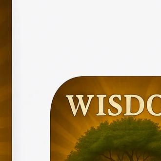

# WISDOM Bible Study Curriculum

<div align="center">



**22 Essential Doctrines of the Christian Faith in 5 Weeks**

[View Website](https://aadey002.github.io/rooted-bible-study/) • [Download Workbooks](https://aadey002.github.io/rooted-bible-study/workbooks.html) • [ROOTED Apparel](https://aadey002.github.io/rooted-bible-study/apparel.html)

</div>

---

## 📖 About

**WISDOM** is a comprehensive Bible study curriculum covering 22 essential doctrines of the Christian faith, organized into 5 weekly sessions. Based on the ordination preparation of Pastor Brian Bailey, this curriculum provides a solid theological foundation rooted in Scripture.

> *"The fear of the LORD is the beginning of wisdom, and the knowledge of the Holy One is understanding."* — Proverbs 9:10

---

## 📚 Curriculum Overview

| Week | Theme | Doctrines | Topics |
|------|-------|-----------|--------|
| **1** | Foundations | A-C | The Scriptures, The Trinity, Angels & Demons |
| **2** | Human Nature | D-F | Man (Created & Fallen), Biblical Roles, First Advent of Christ |
| **3** | Salvation | G-K | Salvation, Extent of Salvation, Sanctification, Security, Assurance |
| **4** | Christian Life | L-P | Holy Spirit, The Church, Ordinances, Christian Walk, Service |
| **5** | Future Things | Q-V | Great Commission, Rapture, Tribulation, Second Coming, Eternal State, Stewardship |

---

## 🌐 Website Structure

```
wisdom-bible-study/
├── index.html          # Homepage
├── week1.html          # Week 1: Foundations (A-C)
├── week2.html          # Week 2: Human Nature (D-F)
├── week3.html          # Week 3: Salvation (G-K)
├── week4.html          # Week 4: Christian Life (L-P)
├── week5.html          # Week 5: Future Things (Q-V)
├── workbooks.html      # Download printable workbooks
├── contact.html        # Contact & Speaking Invitations
├── apparel.html        # ROOTED Apparel (Coming Soon)
├── sitemap.xml         # SEO: Search engine sitemap
├── robots.txt          # SEO: Crawler directives
├── manifest.json       # PWA: Web app manifest
├── favicon.png         # Browser favicon
├── SEO_SETUP_GUIDE.md  # SEO implementation guide
├── images/
│   ├── wisdom_app.png      # App icon
│   ├── wisdom_book.png     # Book cover
│   ├── wisdom_icon_192.png # PWA icon (192x192)
│   ├── wisdom_icon_512.png # PWA icon (512x512)
│   └── wisdom_website.png  # Website hero/OG image
└── pdfs/
    ├── Week1_Workbook.pdf
    ├── Week2_Workbook.pdf
    ├── Week3_Workbook.pdf
    ├── Week4_Workbook.pdf
    ├── Week5_Workbook.pdf
    └── Rooted_Complete_Workbooks.zip
```

---

## 🔍 SEO Features

This website includes comprehensive SEO optimization:

### Meta & Social Tags
- Optimized title tags with keywords
- Meta descriptions for all pages
- Open Graph tags (Facebook, LinkedIn)
- Twitter Card tags
- Canonical URLs

### Structured Data (Schema.org)
- Organization schema
- Course schema
- LearningResource schema for lessons
- ContactPage schema
- Store schema for apparel

### Technical SEO
- `sitemap.xml` for search engines
- `robots.txt` with crawler directives
- `manifest.json` for PWA support
- Mobile-optimized viewport
- Preconnect for performance

### Accessibility
- Skip-to-content links
- ARIA landmarks (navigation, main, contentinfo)
- Semantic HTML structure

**⚠️ Important:** Before deploying, replace all `https://yourdomain.com` placeholders with your actual domain. See `SEO_SETUP_GUIDE.md` for complete instructions.

---

## 📄 Downloadable Resources

### Printable Workbooks
- **Week 1**: Foundations (4 pages)
- **Week 2**: Human Nature (4 pages)
- **Week 3**: Salvation (4 pages)
- **Week 4**: Christian Life (4 pages)
- **Week 5**: Future Things (4 pages)
- **Complete Set**: All 5 weeks (ZIP)

### Complete Book
Available for print: **39 pages, 6" × 9"** (Amazon KDP ready)

---

## 📱 Mobile App

The WISDOM mobile app (React/TSX) features:
- Golden/amber theme design
- Progress tracking
- Memory verse practice
- Discussion questions
- Offline-ready workbooks

---

## 🛍️ ROOTED Apparel

Coming soon! Premium apparel featuring the iconic Wisdom tree design:
- Classic Tee
- Wisdom Hoodie
- Rooted Cap
- Wisdom Mug

---

## 🚀 Deployment

### GitHub Pages (Current)
The site is deployed at: `https://aadey002.github.io/rooted-bible-study/`

### Alternative Deployment Options

**Vercel:**
1. Import this repository
2. Deploy with default settings

**Netlify:**
1. Drag & drop the folder
2. Site goes live instantly

---

## 📋 All 22 Doctrines

| Letter | Doctrine | Week |
|--------|----------|------|
| A | The Scriptures | 1 |
| B | The Godhead (Trinity) | 1 |
| C | Angels (Fallen & Unfallen) | 1 |
| D | Man - His Creation and Fall | 2 |
| E | Biblical Roles of Man and Woman | 2 |
| F | The First Advent of Christ | 2 |
| G | Salvation - Through Christ Alone | 3 |
| H | The Extent of Salvation | 3 |
| I | Sanctification | 3 |
| J | The Security of the Believer | 3 |
| K | Assurance of Salvation | 3 |
| L | The Holy Spirit | 4 |
| M | The Church | 4 |
| N | The Ordinances | 4 |
| O | The Christian Walk | 4 |
| P | Christian Service | 4 |
| Q | The Great Commission | 5 |
| R | The Blessed Hope (Rapture) | 5 |
| S | The Tribulation Period | 5 |
| T | The Second Coming of Christ | 5 |
| U | The Eternal State | 5 |
| V | Stewardship | 5 |

---

## ✝️ Scripture Foundation

This curriculum includes **300+ Scripture references** supporting each doctrine. Every teaching is grounded in God's Word.

---

## 👤 Credits

**Curriculum Development:** Adetoro Oriaifo  
**Based on:** Ordination preparation of Pastor Brian Ellis Bailey  
**Author:** Pastor Brian Bailey

---

## 📜 License

This curriculum is provided for educational and ministry purposes. Feel free to use it for personal study, small groups, and church education.

---

<div align="center">

**🌳 Stay Rooted. Grow in Wisdom. 🌳**

*"Blessed is the one... whose delight is in the law of the LORD... That person is like a tree planted by streams of water."* — Psalm 1:1-3

</div>
